# Algorithms for Generating Random Variables

An important Lemma.

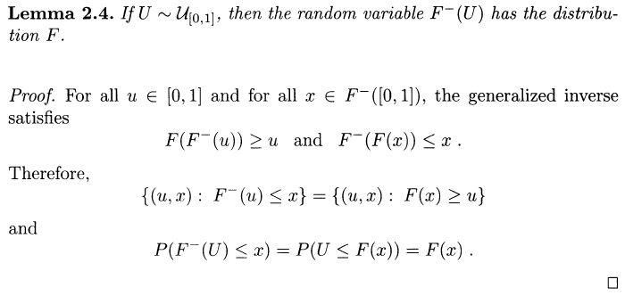

**Note:** Unless otherwise stated, the algorithms and the corresponding screenshots are adopted from [Robert and Casella (2005)](http://cds.cern.ch/record/1187871).

## Box-Muller Algorithm

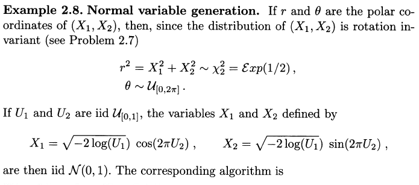

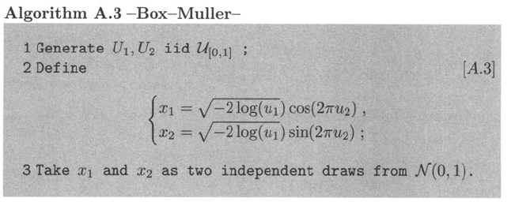

```julia
function boxmuller()
    x = ones(2)
    u = rand(2)
    logu = sqrt(-2*log(u[1]))
    x[1] = logu * cos(2*pi*u[2])
    x[2] = logu * sin(2*pi*u[2])
    return(x)
end

## example
boxmuller()
```

## Accept-Reject Method

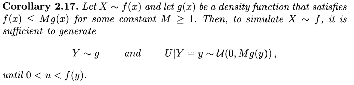

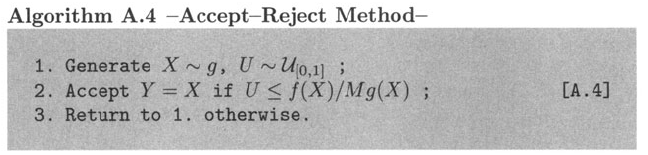

Example:

$$
f(x)\propto \exp(-x^2/2)(\sin(6x)^2+3\cos(x)^2\sin(4x)^2+1)
$$

The Julia code is as follows:

```julia
function AccRej(f::Function, M)
    ## use normal distribution N(0, 1) as sampling function g
    while true
        x = randn()
        u = rand()
        cutpoint = f(x)/(M*g(x))
        if u <= cutpoint
            return([x, f(x)])
        end
    end
end

## density function of N(0, 1)
function g(x)
    return(exp(-0.5*x^2)/sqrt(2*pi))
end

## example function and ignore the normalized constant
function f(x)
    return(exp(-x^2/2)*(sin(6*x)^2 + 3*cos(x)^2*sin(4*x)^2 + 1))
end

## example
N = 500;
data = ones(N, 2);
for i = 1:500
    data[i,:] = AccRej(f, sqrt(2*pi)*5)
end
```

## Envelope Accept-Reject

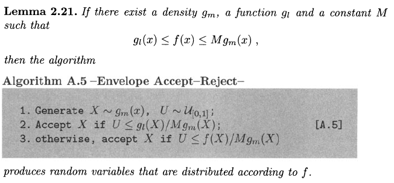

It is easy to write the Julia code:

```julia
function EnvAccRej(f::function, M, gl::function)
    while true
        x = randn() # still assume gm is N(0,1)
        u = rand()
        cutpoint1 = gl(x)/(M*g(x))
        cutpoint2 = f(x)/(M*g(x))
        if u <= cutpoint1
            return(x)
        elseif u <= cutpoint2
            return(x)
        end
    end
end
```

## Atkinson's Poisson Simulation


It is necessary to note that the parameters in the algorithm are not same with those in the density function. In other words, the corresponding density function of the algorithm should be

$$
f(x) = \beta \frac{\exp(\alpha-\beta x)}{[1+\exp(\alpha-\beta x)]^2}.
$$

The following Julia code can generate the poisson random variable with respect to $$\lambda$$.

```julia
function AtkinsonPois(lambda)
    # parameters
    beta = pi/sqrt(3*lambda)
    alpha = lambda*beta
    c = 0.767 - 3.36/lambda
    k = log(c) - lambda - log(beta)
    # step 1: propose new x
    u1 = rand()
    while true
        global x
        x = (alpha - log((1-u1)/u1))/beta
        x > -0.5 && break
    end
    while true
        # step 2: transform to N 
        N = floor(Int, x)
        u2 = rand()
        # step 3: accept or not
        lhs = alpha - beta*x + log(u2/(1+exp(alpha-beta*x))^2)
        rhs = k + N*log(lambda) - log(factorial(lambda))
        if lhs <= rhs
            return(N)
        end
    end
end

## example
N = 100;
res = ones(Int, N);
for i = 1:N
    res[i] = AtkinsonPois(10)
end
# ans: 8 9 13 10 12 .......
```

As mentioned in the above exercise, another poisson generation method can be derived from the following exercise.

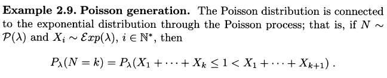

We can write the following Julia code to implement this generation procedure.

```julia
function SimplePois(lambda)
    s = 0
    k = 0
    while true
        u = rand()
        x = -log(u)/lambda
        s = s + x
        if s > 1
            return(k)
        end
        k = k + 1
    end
end

## example for simple poisson
res2 = ones(Int, N);
for i = 1:N 
    res2[i] = SimplePois(10)
end
# ans: 5 7 16 7 10 .......
```

## ARS Algorithm

ARS is based on the construction of an envelope and the derivation of a corresponding Accept-Reject algorithm. It provides a sequential evaluation of lower and upper envelopes of the density $$f$$ when $$h=\log f$$ is concave.

Let $${\cal S}_n$$ be a set of points $$x_i,i=0,1,\ldots,n+1$$, in the support of $$f$$ such that $$h(x_i)=\log f(x_i)$$ is known up to the same constant. Given the concavity of $$h$$, the line $$L_{i,i+1}$$ through $$(x_i,h(x_i))$$ and $$(x_{i+1},h(x_{i+1}))$$ is below the graph of $$h$$ in $$[x_i,x_{i+1}]$$ and is above this graph outside this interval.

For $$x\in [x_i,x_{i+1}]$$, define 

$$
\bar h_n(x)=\min\{L_{i-1,i}(x),L_{i+1,i+2}(x)\}\quad\text{and}\quad \underline h_n(x)=L_{i,i+1}(x)\,,
$$

the envelopes are 

$$
\underline h_n(x)\le h(x)\le \bar h_n(x)
$$

uniformly on the support of $$f$$. Thus,

$$
\exp \underline h_n(x) = \underline f_n(x) \le f(x)\le \bar f_n(x)=\exp\bar h_n(x) = \bar w_ng_n(x)\,.
$$

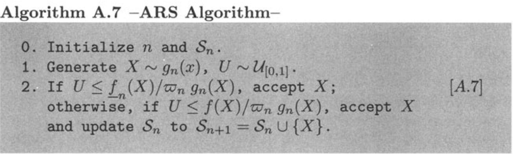

[Davison (2008)](http://www.cambridge.org/hk/academic/subjects/statistics-probability/statistical-theory-and-methods/statistical-models) provides another version of ARS 

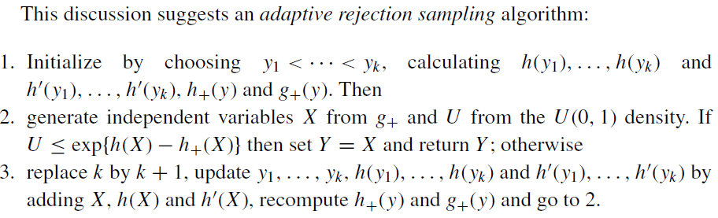

and gives an illustration example.

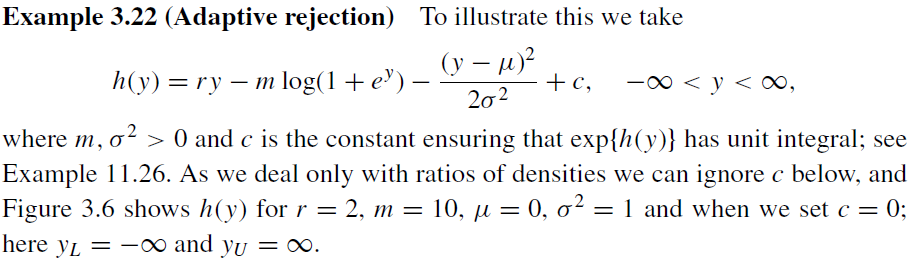

Let's consider the slightly simple verison in which we do not need to consider $$h_-(y)$$. It is obvious that

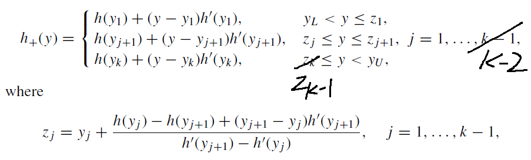

Consider the CDF of $$g_+=\exp(h_+)$$:

$$
\begin{aligned}
	G_+(y) & = \int_{-\infty}^y \exp(h_+(x)) dx \\
		   & = \int_{-\infty}^{\min\{z_1,y\}} \exp(h_+(x)) dx \\
		   & \qquad + \int_{z_1}^{\min\{z_2,\max\{y, z_1\}\}} \exp(h_+(x)) dx \\ 
		   & \qquad + \cdots \\
		   & \qquad + \int_{z_{k-1}}^{\min\{z_k,\max\{y, z_{k-1}\}\}} \exp(h_+(x)) dx \\
		   & \qquad + \int_{z_k}^{\max\{z_k,y\}} \exp(h_+(x)) dx
\end{aligned}
$$

and 

$$
\int_{z_{j}}^{z_{j+1}}\exp(h_+(x))dx = \exp({h(y_{j+1})})\cdot \frac{1}{h'(y_{j+1})}\exp((y-y_{j+1})h'(y_{j+1}))\mid_{z_j}^{z_{j+1}},\; j=1,\ldots,k-1
$$

Then use the inverse of $$G_+(y)$$ to sample random variable whose density function is $$g_+(x)$$. So we can use the following Julia program to sample from $$g_+(x)$$.

```julia
# example 3.22 in Davison(2008)
r = 2; m = 10; mu = 0; sig2 = 1;
# range of y
yl = -2; yu = 2;
# function of h
function h(y)
    return(r * y - m * log(1 + exp(y)) - (y - mu)^2 / (2 * sig2))
end

function h(y::Array)
    return(r * y - m * log.(1 .+ exp.(y)) .- (y .- mu) .^2 ./ (2 * sig2))
end

# derivative of h
function dh(y)
    return(r - m * exp(y) / (1 + exp(y)) - (y - mu) / sig2)
end

function dh(y::Array)
    return(r .- m * exp.(y) ./ (1 .+ exp.(y)) .- (y .- mu)./sig2)
end

# intersection point
function zfix(yfixed::Array)
    yf0 = yfixed[1:end-1]
    yf1 = yfixed[2:end]
    zfixed = yf0 .+ (h(yf0) .- h(yf1) .+ (yf1 .- yf0) .* dh(yf1)) ./ (dh(yf1) .- dh(yf0))
    return(zfixed)
end

# evaluate log-density (not necessary)
function hplus(y::Float64, yfixed::Array)
    zfixed = zfix(yfixed)
    n = size(zfixed, 1)
    for i = 1:n
        if i == 1 && y < zfixed[i]
            return(h(yfixed[i]) + (y - yfixed[i]) * dh(yfixed[i]))
        elseif i < n && y >= zfixed[i] && y < zfixed[i+1]
            return(h(yfixed[i+1]) + (y - yfixed[i+1]) * dh(yfixed[i+1]))
        elseif i == n && y >= zfixed[n]
            return(h(yfixed[i]) + (y - yfixed[i]) * dh(yfixed[i]))
        end
    end
end

# calculate G_+(z_i)
function gplus_cdf(yfixed::Array, zfixed::Array)
    n = size(zfixed, 1)
    s = zeros(n+1)
    pr = zeros(n+1)
    for i = 1:(n+1)
        ## integral from -infty to zi
        if i == 1
        #    s[i] = exp(h(yfixed[i])) / dh(yfixed[i]) * (exp((zfixed[i]-yfixed[i]) * dh(yfixed[i])) - )
            s[i] = exp(h(yfixed[i])) / dh(yfixed[i]) * (exp((zfixed[i]-yfixed[i]) * dh(yfixed[i])) - exp((yl-yfixed[i]) * dh(yfixed[i])))
        elseif i == n+1
            s[i] = exp(h(yfixed[i])) / dh(yfixed[i]) * (exp((yu-yfixed[i]) * dh(yfixed[i])) - exp((zfixed[n]-yfixed[i]) * dh(yfixed[i])))
        else
            s[i] = exp(h(yfixed[i])) / dh(yfixed[i]) * (exp((zfixed[i]-yfixed[i]) * dh(yfixed[i])) - exp((zfixed[i]-yfixed[i]) * dh(yfixed[i])))
        end
    end
    pr = s / sum(s)
    return cumsum(pr), sum(s)
end

# sample from gplus density
function gplus_sample(yfixed)
    zfixed = zfix(yfixed)
    gp = gplus_cdf(yfixed, zfixed)
    zpr = gp[1]
    norm_const = gp[2]
    n = size(zfixed, 1)
    u = rand()
    # Invert the gplus pdf
    for i = 1:n
        if i == 1 && u < zpr[i]
            ey = u * dh(yfixed[i]) * norm_const / exp(h(yfixed[i])) + exp((yl-yfixed[i])*dh(yfixed[i]))
            return(yfixed[i] + log(ey)/dh(yfixed[i]))    
        elseif i == n && u >= zpr[i]
            ey = (u - zpr[i]) * dh(yfixed[i+1]) * norm_const / exp(h(yfixed[i+1])) + exp((zfixed[i]-yfixed[i+1])*dh(yfixed[i+1]))
            return(yfixed[i+1] + log(ey)/dh(yfixed[i+1]))
        elseif i < n && u >= zpr[i] && u < zpr[i+1]
            ey = (u - zpr[i]) * dh(yfixed[i+1]) * norm_const / exp(h(yfixed[i+1])) + exp((zfixed[i]-yfixed[i+1])*dh(yfixed[i+1]))
            return(yfixed[i+1] + log(ey)/dh(yfixed[i+1]))
        end
    end
end
```

Back to the main sampling algorithm, we can implement the procedure as follows:

```julia
## adaptive rejection sampling
function ars(yfixed::Array)
    x = gplus_sample(yfixed)
    u = rand()
    if u <= exp(h(x)-hplus(x, yfixed))
        return(x)
    else
        return(ars(append!(yfixed, x)))
    end
end

## example
N = 100
res = ones(N);
for i = 1:N
    res[i] = ars([-1.8,-1.1,-0.5,-0.2])
end
```

Based on the ARS algorithm, we can also get the Supplemental ARS algorithm:


