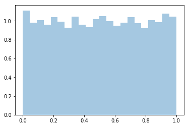
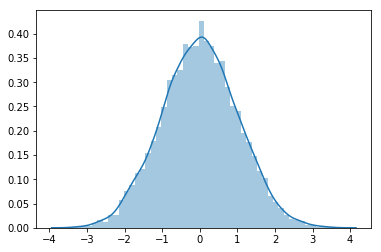
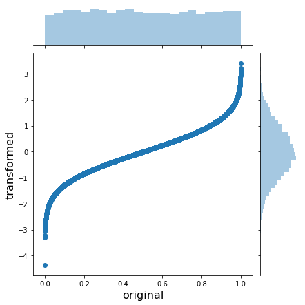
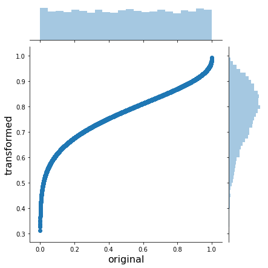
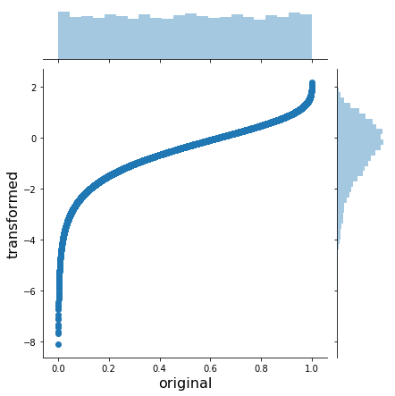
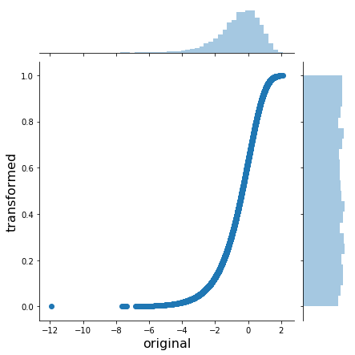
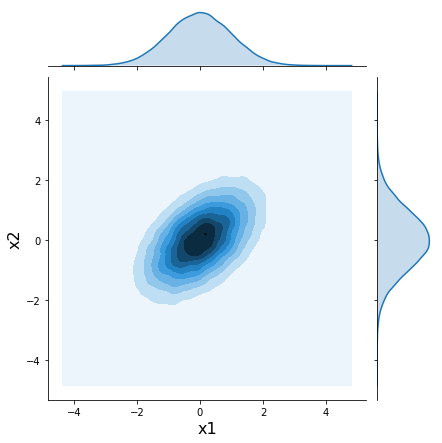
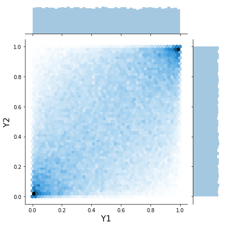
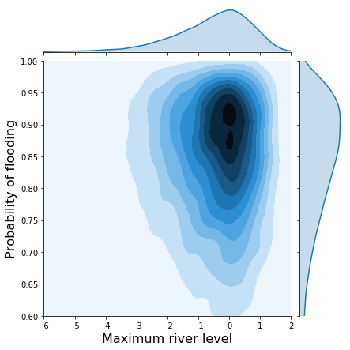

# An intuitive visual, guide to copulas

refer to [An intuitive, visual guide to copulas](https://twiecki.io/blog/2018/05/03/copulas/)


```python
%matplotlib inline

import seaborn as sns
from scipy import stats
```

## Random Variable Transformation


```python
# uniform sampling
x = stats.uniform(0, 1).rvs(10000)
sns.distplot(x, kde=False, norm_hist=True)
```


    <matplotlib.axes._subplots.AxesSubplot at 0x7f93b259d908>





```python
# inverse CDF
norm = stats.norm()
x_trans = norm.ppf(x)
sns.distplot(x_trans)
```


    <matplotlib.axes._subplots.AxesSubplot at 0x7f93b2f28438>





```python
h = sns.jointplot(x, x_trans, stat_func=None)
h.set_axis_labels('original', 'transformed', fontsize=16)
```


    <seaborn.axisgrid.JointGrid at 0x7f93b3cec6a0>





```python
# same work for beta
beta = stats.beta(a=10, b=3)
x_trans = beta.ppf(x)
h = sns.jointplot(x, x_trans, stat_func=None)
h.set_axis_labels('original', 'transformed', fontsize=16)
```


    <seaborn.axisgrid.JointGrid at 0x7f93b2f91d30>





```python
# same work for Gumbel
gumbel = stats.gumbel_l()
x_trans = gumbel.ppf(x)
h = sns.jointplot(x, x_trans, stat_func=None)
h.set_axis_labels('original', 'transformed', fontsize=16)
```


    <seaborn.axisgrid.JointGrid at 0x7f93b24258d0>





```python
# convert an arbitrary distribution to the uniform (0, 1): CDF
x_trans_trans = gumbel.cdf(x_trans)
h = sns.jointplot(x_trans, x_trans_trans, stat_func=None)
h.set_axis_labels('original', 'transformed', fontsize=16)
```


    <seaborn.axisgrid.JointGrid at 0x7f93b3305b00>





## Adding correlation with Gaussian copulas


```python
mvnorm = stats.multivariate_normal(mean = [0, 0], cov = [[1., 0.5], [0.5, 1.]])
x = mvnorm.rvs(100000)
```


```python
h = sns.jointplot(x[:, 0], x[:, 1], kind = 'kde', stat_func = None)
h.set_axis_labels('x1', 'x2', fontsize=16)
```


    <seaborn.axisgrid.JointGrid at 0x7f93b2294400>





```python
norm = stats.norm()
x_unif = norm.cdf(x)
h = sns.jointplot(x_unif[:, 0], x_unif[:, 1], kind='hex', stat_func=None)
h.set_axis_labels('Y1', 'Y2', fontsize=16)
```


    <seaborn.axisgrid.JointGrid at 0x7f93b21c8da0>





```python
# transform the marginal
m1 = stats.gumbel_l()
m2 = stats.beta(a=10, b=2)

x1_trans = m1.ppf(x_unif[:, 0])
x2_trans = m2.ppf(x_unif[:, 1])

h = sns.jointplot(x1_trans, x2_trans, kind='kde', xlim=(-6, 2), ylim=(.6, 1.0), stat_func=None)
h.set_axis_labels('Maximum river level', 'Probability of flooding', fontsize=16)
```


    <seaborn.axisgrid.JointGrid at 0x7f93b0762358>


```python
# compare with the joint distribution without correlation
x1 = m1.rvs(10000)
x2 = m2.rvs(10000)

h = sns.jointplot(x1, x2, kind='kde', xlim=(-6, 2), ylim=(.6, 1.0), stat_func=None)
h.set_axis_labels('Maximum river level', 'Probability of flooding', fontsize=16)
```


    <seaborn.axisgrid.JointGrid at 0x7f93b0678240>





```python

```
