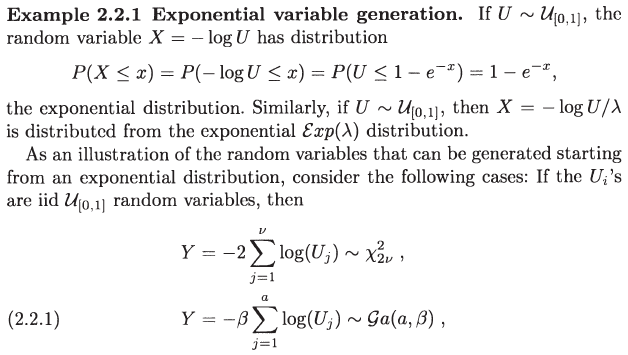
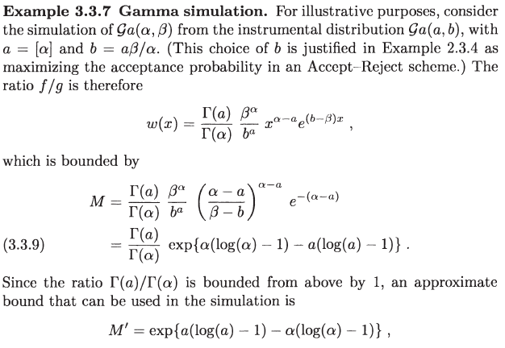
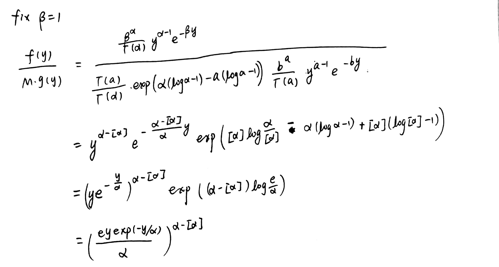
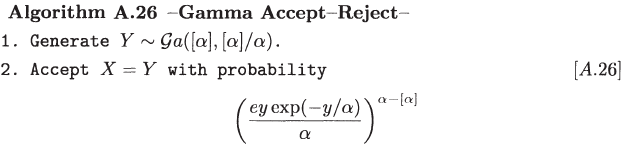

# Special Distributions

## Gamma distribution

Firstly, let's introduce how to generate $${\mathcal G}a(a,\beta)$$ where $$a$$ is an integral ([Robert and Casella (2013)](https://www.springer.com/gp/book/9781475730715)).



Then when considering the general $${\mathcal G}a(\alpha,\beta)$$, we can use $${G}a(a, b)$$ as instrumental distribution in Accept-Rejection algorithm as mentioned in [Robert and Casella (2013)](https://www.springer.com/gp/book/9781475730715):



```julia
## sample from Ga(a, beta)
function rgamma_int(a::Int, beta)
    u = rand(a)
    return(-1.0 * beta * sum(log.(u)))
end

## density of Ga(alpha, beta)
include("func_gamma.jl")
function dgamma(x, alpha, beta)
    return(beta^alpha / lanczos_gamma(alpha) * x^(alpha-1) * exp(-1*beta*x))
end

## accept-reject algorithm
function rgamma(alpha = 1.5, beta = 2.1)
    a = Int(floor(alpha))
    b = a * beta / alpha
    M = exp(a * (log(a) - 1) - alpha * (log(alpha) - 1))
    while true
        x = rgamma_int(a, b)
        u = rand()
        cutpoint = dgamma(x, alpha, beta)/(M*dgamma(x, a, b))
        if u <= cutpoint
            return x
        end
    end
end

# example
println(rgamma())
```

where [`func_gamma.jl`](func_gamma.jl) is to calculate gamma function via [Lanczos Approximation](https://mrob.com/pub/ries/lanczos-gamma.html) because there is not gamma function in Julia.

If $$\beta=1$$, we can do some further calculations, 



and would get more simpler expression,




