# Gibbs Sampler

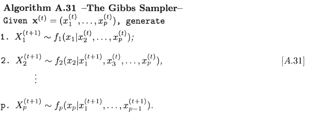

## Bivariate Gibbs sampler

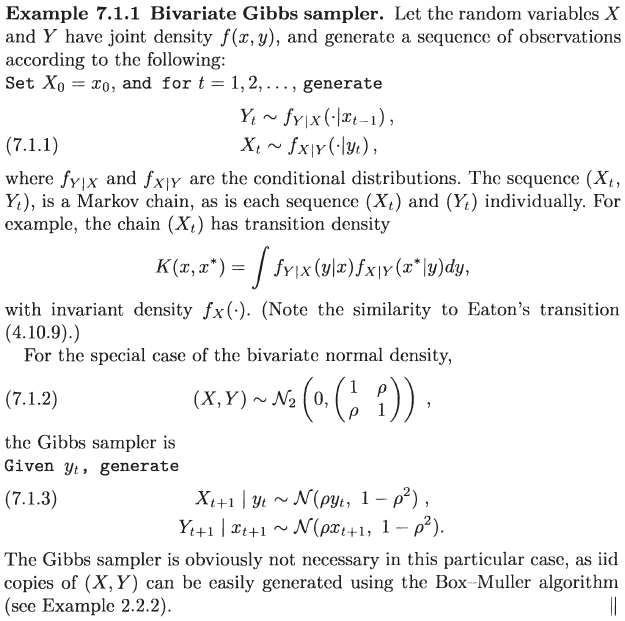

It is easy to implement this sampler:

```julia
## Julia program for Bivariate Gibbs sampler
## author: weiya <szcfweiya@gmail.com>
## date: 2018-08-22

function bigibbs(T, rho)
    x = ones(T+1)
    y = ones(T+1)
    for t = 1:T
        x[t+1] = randn() * sqrt(1-rho^2) + rho*y[t]
        y[t+1] = randn() * sqrt(1-rho^2) + rho*x[t+1]
    end
    return x, y
end

## example
bigibbs(100, 0.5)
```

## Completion Gibbs Sampler

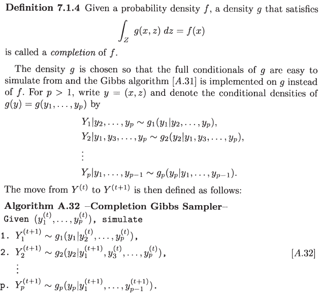

Example:

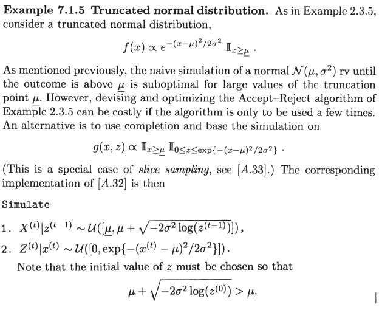

We can use the following Julia program to implement this algorithm.

```julia
## Julia program for Truncated normal distribution
## author: weiya <szcfweiya@gmail.com>
## date: 2018-08-22

# Truncated normal distribution
function rtrunormal(T, mu, sigma, mu_down)
    x = ones(T)
    z = ones(T+1)
    # set initial value of z
    z[1] = rand()
    if mu < mu_down
        z[1] = z[1] * exp(-0.5 * (mu - mu_down)^2 / sigma^2)
    end
    for t = 1:T
        x[t] = rand() * (mu - mu_down + sqrt(-2*sigma^2*log(z[t]))) + mu_down
        z[t+1] = rand() * exp(-(x[t] - mu)^2/(2*sigma^2))
    end
    return(x)
end

## example
rtrunormal(1000, 1.0, 1.0, 1.2)
```

## Slice Sampler

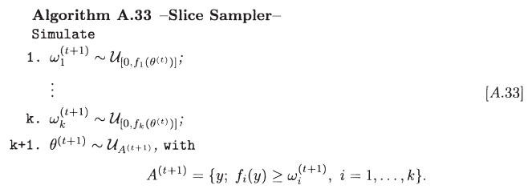

Consider the normal distribution as an instance.

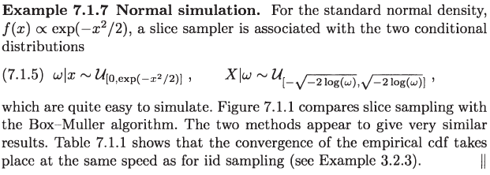

It is also easy to write the following Julia program.

```julia
## Julia program for Slice sampler
## author: weiya <szcfweiya@gmail.com>
## date: 2018-08-22

function rnorm_slice(T)
    x = ones(T+1)
    w = ones(T+1)
    for t = 1:T
        w[t+1] = rand() * exp(-1.0 * x[t]^2/2)
        x[t+1] = rand() * 2 * sqrt(-2*log(w[t+1])) - sqrt(-2*log(w[t+1]))
    end
    return x[2:end]
end

## example
rnorm_slice(100)
```

## Data Augmentation

A special case of Completion Gibbs Sampler.

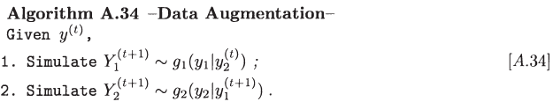

Let's illustrate the scheme with grouped counting data.

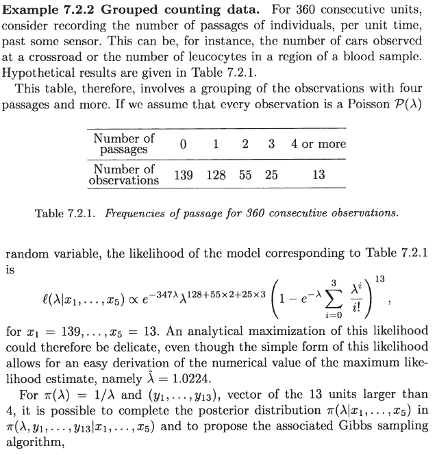

And we can obtain the following algorithm,

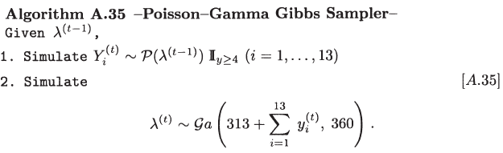

But it seems to be not obvious to derive the above algorithm, so I wrote some more details

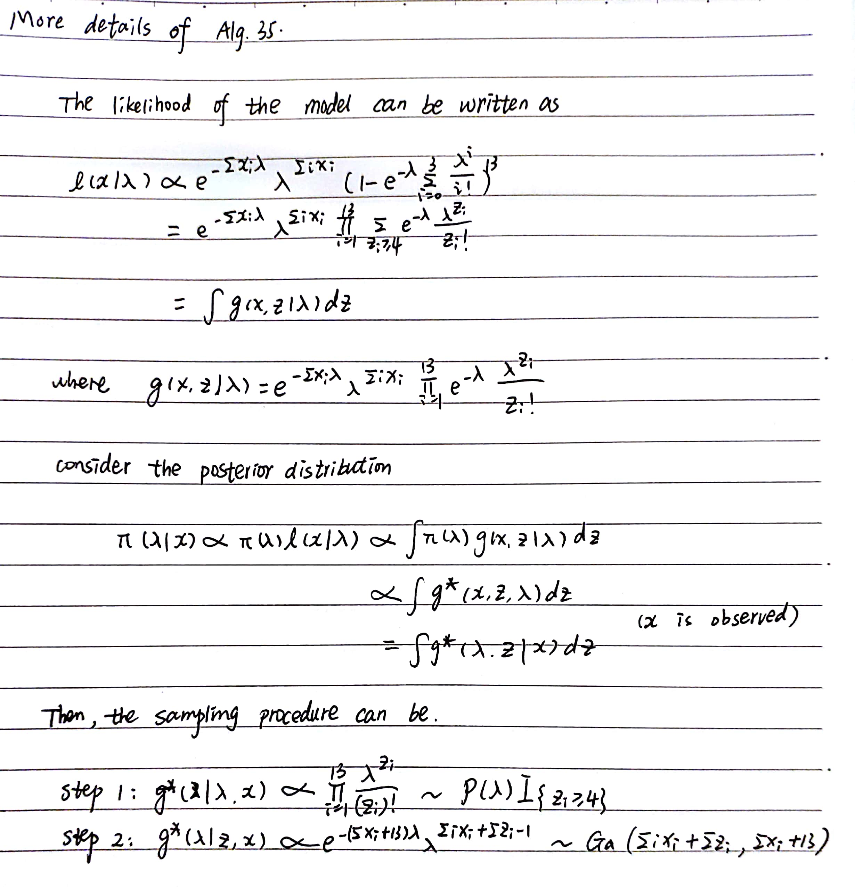

## Reversible Data Augmentation

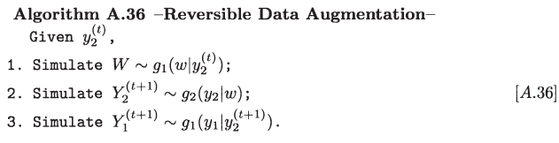

## Reversible Gibbs Sampler

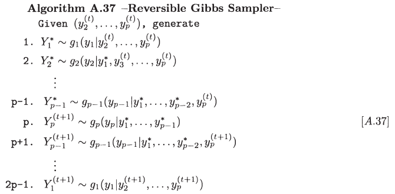

## Random Sweep Gibbs Sampler

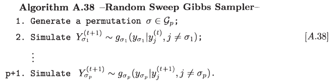

## Random Gibbs Sampler

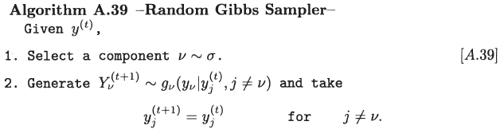

## Hybrid Gibbs Samplers

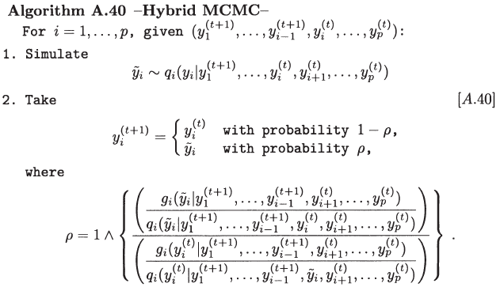

## Metropolization of the Gibbs Sampler

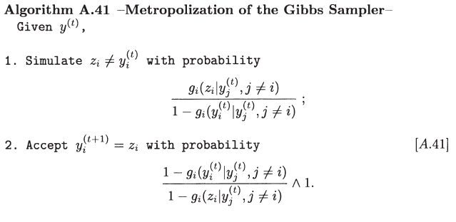

Let us illuatrate this algorithm with the following example.

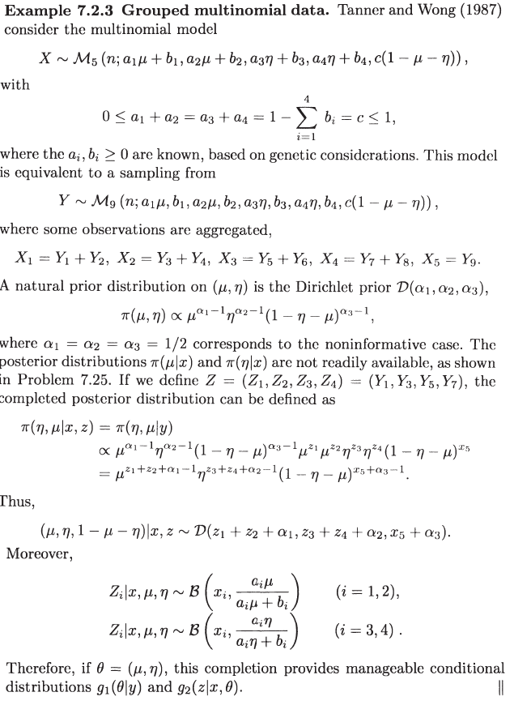

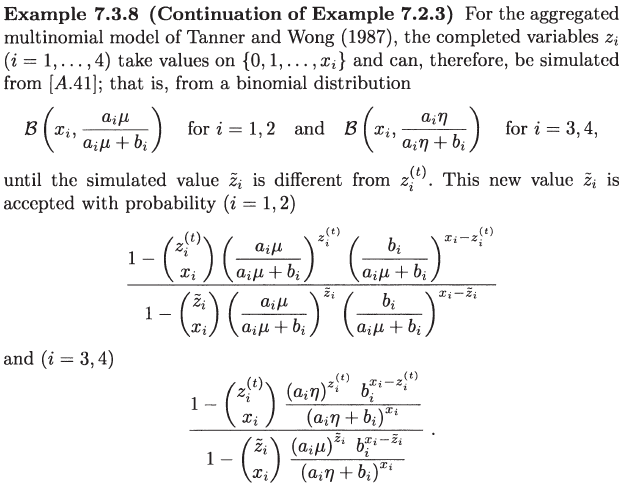


