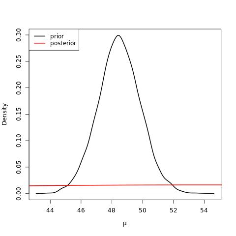
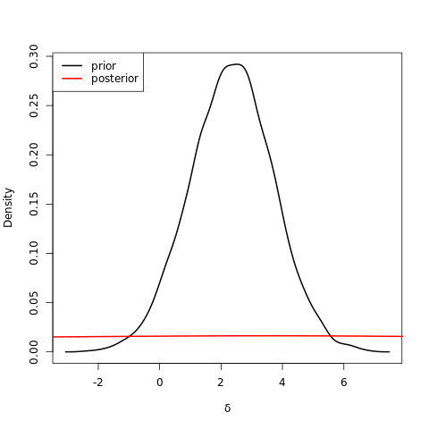

# Group comparisons

This section is based on chapter 8 of [Hoff, P. D. (2009)](https://github.com/szcf-weiya/MonteCarlo/blob/master/References/A_First_Course_in_Bayesian_Statistical_Methods.pdf).

We can use the following R code to approximate the posterior distribution $$p(\mu, \delta, \sigma^2\mid \mathbf y_1,\mathbf y_2)$$.

```r
#!/usr/bin/env Rscript
## R program for Comparing two groups

## get data
## you can found it on Peter Hoff's website
## https://www.stat.washington.edu/~pdhoff/book.php

Y.school.mathscore<-dget("Y.school.mathscore")
y.school1<-dget("y.school1")
y.school2<-dget("y.school2")

y1 = y.school1; n1 = length(y1)
y2 = y.school2; n2 = length(y2)

## prior parameters
mu0 = 50; g02 = 625
del0 = 0; t02 = 625
s20 = 100; nu0 = 1

## starting value
mu = (mean(y1) + mean(y2)) / 2
del = (mean(y1) - mean(y2)) / 2

## gibbs sampler
MU = DEL = S2 = NULL
set.seed(1)
for (s in 1:5000)
{
  # update s2
  s2 = 1/rgamma(1, (nu0+n1+n2)/2, (nu0*s20+sum((y1-mu-del)^2)+sum((y2-mu+del)^2))/2)
  
  # update mu
  var.mu = 1/(1/g02 + (n1+n2)/s2)
  mean.mu = var.mu*(mu0/g02+sum(y1-del)/s2+sum(y2+del)/s2)
  mu = rnorm(1, mean.mu, sqrt(var.mu))
  
  # update del
  var.del = 1/(1/t02 + (n1+n2)/s2)
  mean.del = var.del*(del0/t02 + sum(y1-mu)/s2 - sum(y2 - mu)/s2)
  del = rnorm(1, mean.del, sqrt(var.del))
  
  # save parameter values
  MU = c(MU, mu)
  DEL = c(DEL, del)
  S2 = c(S2, s2)
}

# plot
png("reproduce-fig-8-2l.png")
plot(density(MU), main="", xlab=expression(mu), lwd=2, col="black")
lines(density(rnorm(5000, 50, 25)), col="red", lwd=2)
legend("topleft", c("prior", "posterior"), col=c("black","red"), lwd=2)
dev.off()

png("reproduce-fig-8-2r.png")
plot(density(DEL), main="", xlab=expression(delta), lwd=2, col="black")
lines(density(rnorm(5000, 0, 25)), col="red", lwd=2)
legend("topleft", c("prior", "posterior"), col=c("black","red"), lwd=2)
dev.off()
```

We can reproduce the figures as show in Fig. 8.2.



