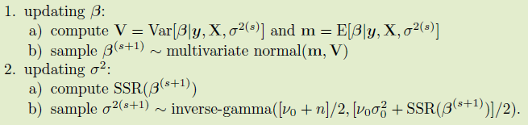
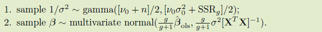

# Linear Regression

The variable selection problem has a natural Bayesian solution: Any collection of models having different sets of regressors can be computed via their Bayes factors.

## A semiconjugate prior distribution

Let $$\beta \sim MN(\boldsymbol\beta_0, \Sigma_0)$$, then

$$
\beta\mid \mathbf y,\mathbf X, \sigma^2 \sim N((\Sigma_0^{-1}+\mathbf X^T\mathbf X/\sigma^2)^{-1}(\Sigma_0^{-1}\boldsymbol\beta_0+\mathbf X^T\mathbf y/\sigma^2), (\Sigma_0^{-1}+\mathbf X^T\mathbf X/\sigma^2)^{-1})
$$

and let $$1/\sigma^2\sim Ga(\nu_0/2,\nu_0\sigma_0^2/2)$$, then

$$
1/\sigma^2\mid \mathbf y,\mathbf X,\boldsymbol\beta \sim Ga([\nu_0+n]/2, [\nu_0\sigma_0^2+SSR(\boldsymbol \beta)]/2)
$$

Then we can construct the following Gibbs sampler:

## Weakly informative prior distributions

1. unit information prior
2. the parameter estimation should be invariant to changes in the scale of the regressors.

For the second case, we can derive a Monte Carlo approximation:

since

$$
p(\sigma^2,\boldsymbol\beta\mid \mathbf y, \mathbf X)\propto p(\boldsymbol\beta\mid \mathbf y,\mathbf X,\sigma^2)p(\sigma^2\mid \mathbf y,\mathbf X)
$$
