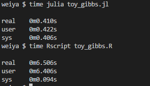
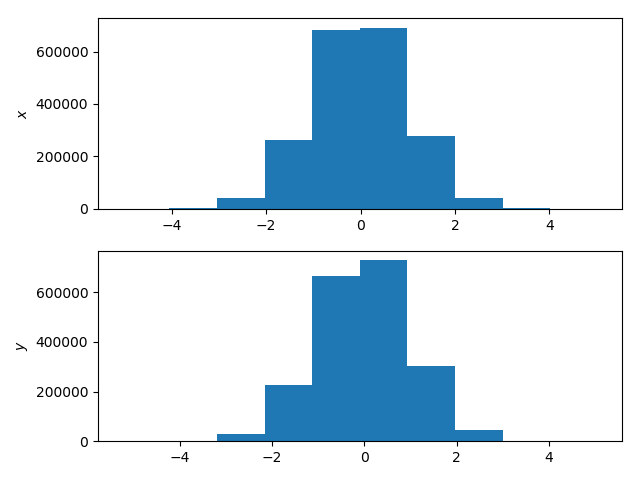

# R vs. Julia in MCMC

> Lijun Wang 
>
> 29 August, 2018
> 


Let me use the Example 7.1.1 of [Robert and Casella (2013)](https://www.springer.com/gp/book/9781475730715) to compare the speed of R and Julia in MCMC.


We can implement this example with the following code. It is worth noting that I try to keep the same form between this two programming language as much as possible. For example, Julia does not support arbitrary mean and variance in its Gaussian sampling function `randn()`, while R can directly realize in `rnorm()`, but we both adopt the linear transformation of Gaussian distribution.

## R

```R
bigibbs <- function(T, rho)
{
    x = numeric(T+1)
    y = numeric(T+1)
    for (t in 1:T){
        x[t+1] = rnorm(1) * sqrt(1-rho^2) + rho*y[t]
        y[t+1] = rnorm(1) * sqrt(1-rho^2) + rho*x[t+1]
    }
    return(list(x=x, y=y))
}
## example
res = bigibbs(2e6, 0.5)
```

## Julia

```julia
function bigibbs(T::Int64, rho::Float64)
    x = ones(T+1)
    y = ones(T+1)
    for t = 1:T
        x[t+1] = randn() * sqrt(1-rho^2) + rho*y[t]
        y[t+1] = randn() * sqrt(1-rho^2) + rho*x[t+1]
    end
    return x, y
end

## example
x, y = bigibbs(Int64(2e6), 0.5)
```

## Results

The running environment is as follows:

- System: Ubuntu 18.04 (Windows subsystem for Linux)
- Processor: Intel(R) Core(TM) i7-6700 CPU @ 3.40GHz x 8
- Memory: 16 GiB
- R version: 3.4.4 (2018-03-15)
- Julia version: 1.0.0 (2018-08-08)

In terminal, use `time` command to get their running time:



Obviously, in our toy example, Julia outperforms much than R, nearly 16 times. Try another number of iterations, the results are similar.

Moreover, we can use `PyPlot` to plot in Julia v1.0, such as the histogram in this toy example:




