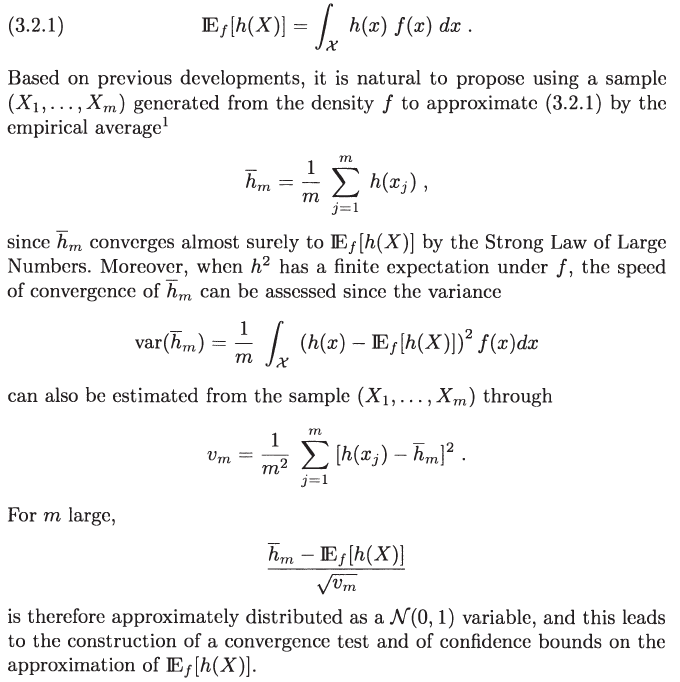
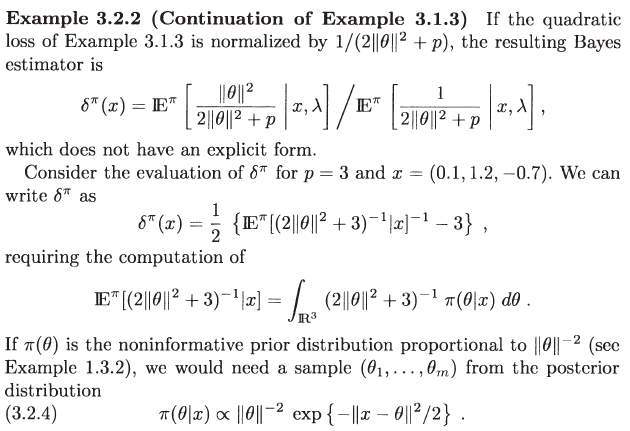

# Monte Carlo Integration

## Classical Monte Carlo Integration

[Robert and Casella (2013)](https://www.springer.com/gp/book/9781475730715) introduces the classical Monte Carlo integration:



## Toy Example

为了计算积分

我们通常采用MC模拟:

1. 计算区域的volume：
2. 近似：

根据大数律有


并且由中心极限定理有


其中

另外，注意到

$$
I = \int_Dg(\mathbf x)d\mathbf x = \int_D Vg(\mathbf x)\frac 1V d\mathbf x = {\mathbb E}_f[Vg(\mathbf x)],
$$

则可以直接利用上一节的结论。

```r
## estimate pi
##
## I = \int H(x, y)dxdy
## where H(x, y) = 1 when x^2+y^2 <= 1;
## otherwise H(x, y) = 0

## volume
V = 4

n = 100000
x = runif(n, -1, 1)
y = runif(n, -1, 1)
H = x^2+y^2
H[H<=1] = 1
H[H>1] = 0
I = V* mean(H)
cat("I = ", I, "\n")

## n = 100, I = 2.96
## n = 1000, I = 3.22
## n = 10000, I = 3.1536
## n = 100000, I = 3.14504
```

## Polar Simulation

**Note:** Unless otherwise stated, the algorithms and the corresponding screenshots are adopted from [Robert and Casella (2013)](https://www.springer.com/gp/book/9781475730715).




The following Julia program can be used to do polar simulation.

```julia
using Statistics

function polarsim(x::Array)
    while true
        phi1 = rand()*2*pi
        phi2 = rand()*pi - pi/2
        u = rand()
        xdotxi = x[1]*cos(phi1) + x[2]*sin(phi1)*cos(phi2) + x[3]*sin(phi1)*sin(phi2)
        if u <= exp(xdotxi - sum(x.^2)/2)
            return(randn() + xdotxi)
        end
    end
end

# approximate E^pi
function Epi(m, x = [0.1, 1.2, -0.7])
    rhos = ones(m)
    for i = 1:m
        rhos[i] = 1/(2*polarsim(x)^2+3)
    end
    return(mean(rhos))
end

# example
Epi(10)
```

