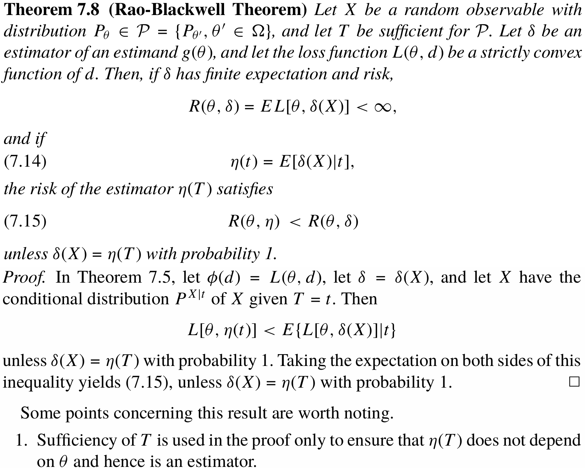
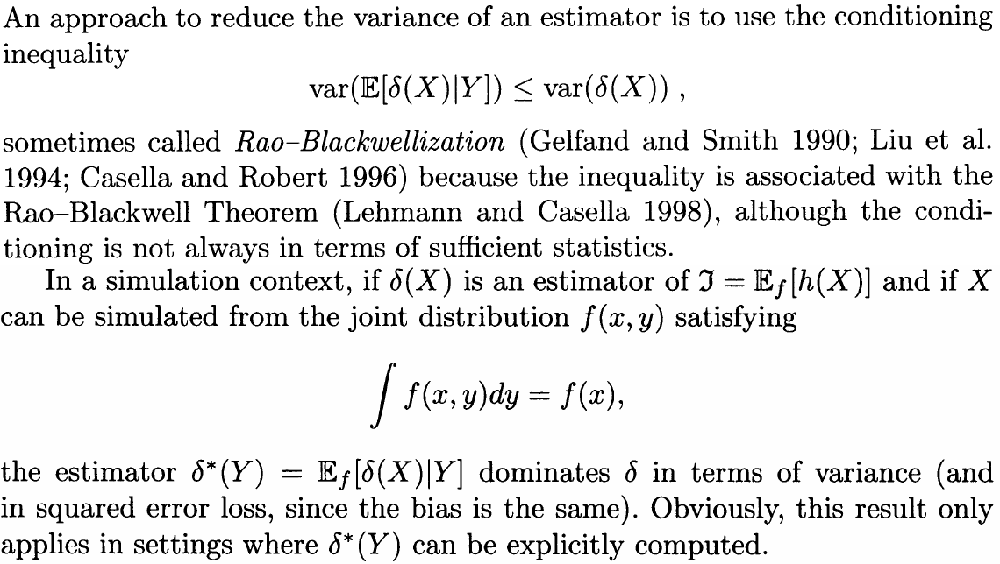
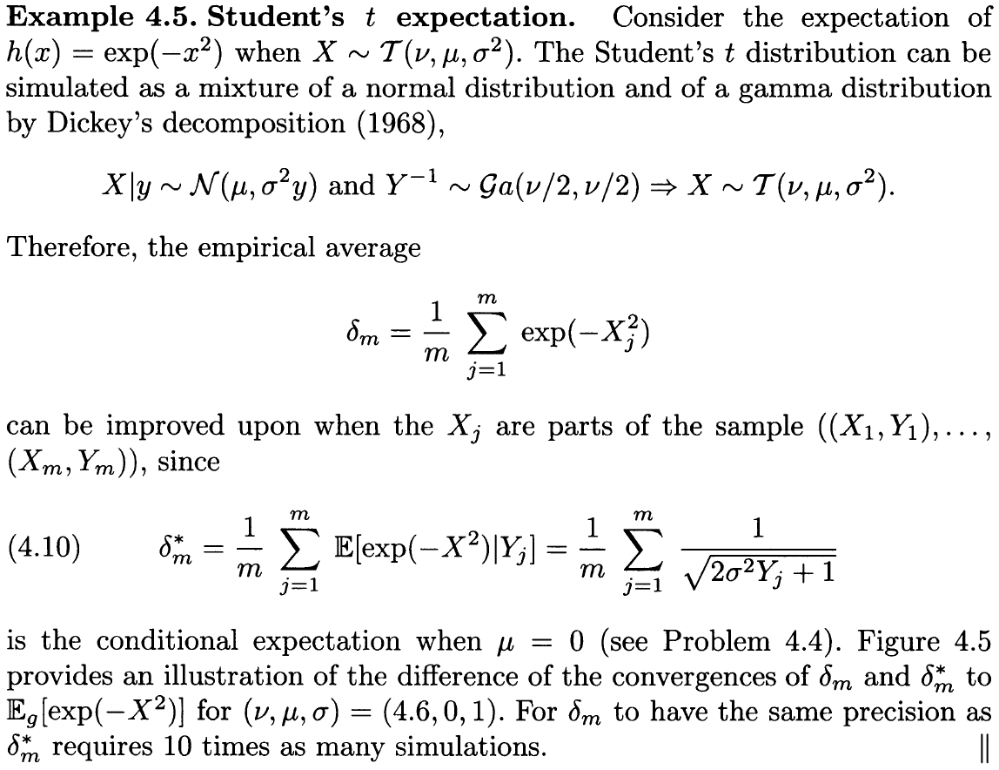
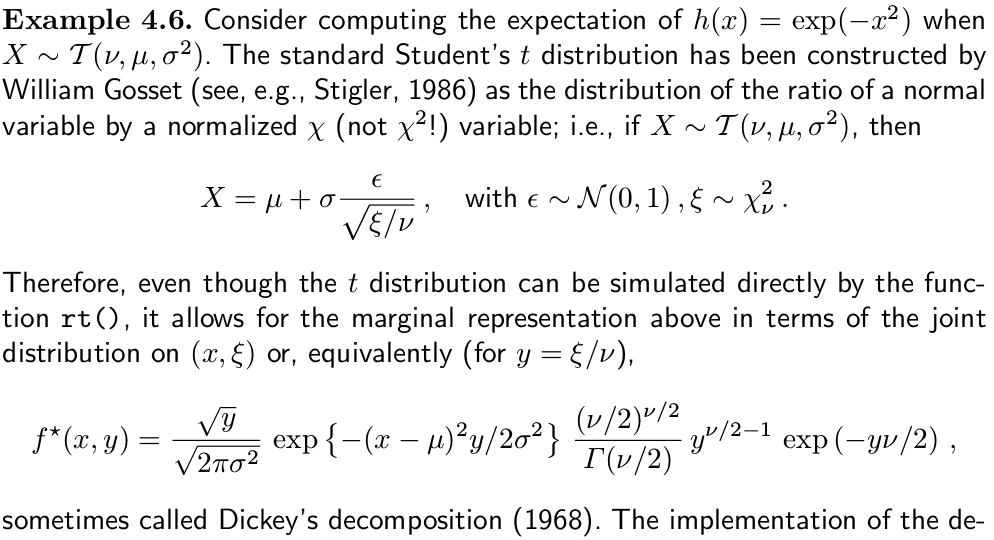

# Rao-Blackwellization

## Recall: Rao-Blackwell Theorem



**Rao-Blackwellization** is that



## Example: Student's $$t$$ expectation



Here Gamma is in (α, β) form.

Alternative way to look at such decomposition



Compare the performance with two cases,

```julia
using Distributions
using Plots

function rt_dickey(n, μ, ν, σ)
    # sample y firstly
    dist_y = InverseGamma(ν/2, ν/2)
    ys = rand(dist_y, n)
    # sample x
    xs = σ * randn(n) .* sqrt.(ys) .+ μ
    return xs, ys
end

function cmp_res(n, μ, ν, σ)
    xs, ys = rt_dickey(n, μ, ν, σ)
    cum_δm = cumsum( exp.(- xs .^2) )
    cum_δm_star = cumsum( 1 ./ sqrt.(2 * σ^2 .* ys .+ 1) .* exp.(-μ^2 ./ (1 .+ 2*σ^2 .* ys)) )
    δm = cum_δm ./ (1:n)
    δm_star = cum_δm_star ./ (1:n)
    p = plot(δm, label = "MC")
    plot!(p, δm_star, label = "RB")
    return p
end

using Random
Random.seed!(123)
p1 = cmp_res(10000, 0, 4.6, 1)
p2 = cmp_res(10000, 3, 5, 0.5)
plot(p1, p2)
savefig("two-situations.svg")
```


