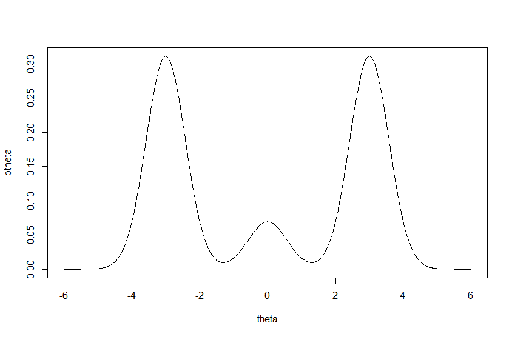
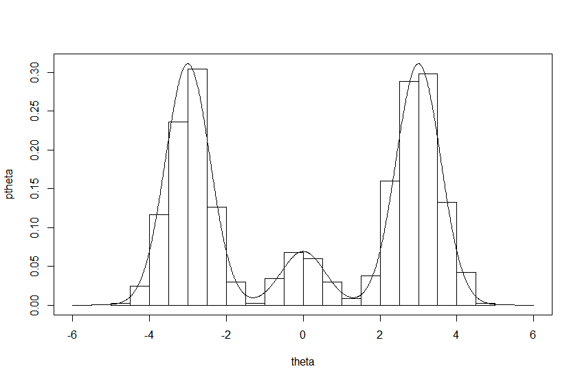
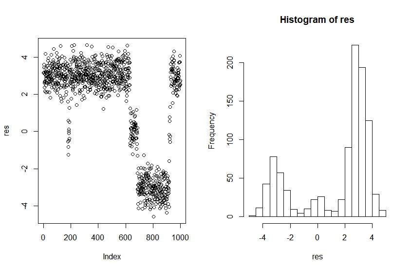
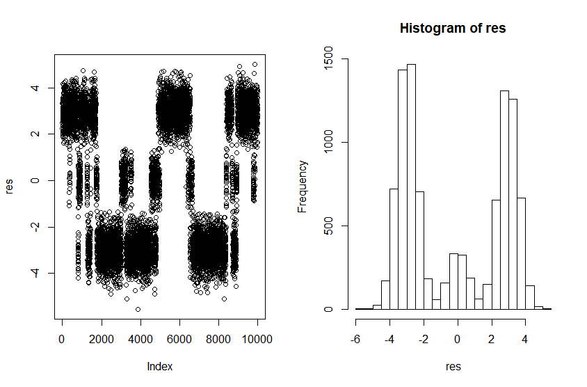

# MCMC diagnostics

Explore the difference between MC and MCMC with a sample example. 

A discrete variable $$\delta\sim\{1,2,3\}$$ and a continuous variable $$\theta\in\mathrm{I\!R}$$.

```r

# discrete variable
delta = c(.45, .10, .45)

# continuous variable
mu = c(-3, 0, 3)
sigma2 = c(1/3, 1/3, 1/3)

# exact marginal density of theta
ext_margin_den <- function(x)
{
  dnorm(x, mu[1], sqrt(sigma2[1])) * delta[1] +
    dnorm(x, mu[2], sqrt(sigma2[2])) * delta[2] +
    dnorm(x, mu[3], sqrt(sigma2[3])) * delta[3]
}

theta = seq(-6, 6, length.out = 1000)
ptheta = ext_margin_den(theta)
plot(theta, ptheta, type = "l")
```

The marginal density of $$\theta$$ would be 



Firstly, generate 1000 Monte Carlo $$\theta$$-samples.



```r

sample_delta <- function(x)
{
  denx = c(delta[1] * dnorm(x, mu[1], sqrt(sigma2[1])),
           delta[2] * dnorm(x, mu[2], sqrt(sigma2[2])),
           delta[3] * dnorm(x, mu[3], sqrt(sigma2[3])))
  condenx = denx / sum(denx)
  sample(1:3, 1, prob = condenx)
}
# gibbs sampler
gibbs <- function(m, delta = 3)
{
  DELTA = delta
  THETA = NULL
  for (i in 1:m)
  {
    # sample theta from full conditional distribution
    theta = sample_theta(delta)
    THETA = c(THETA, theta)
    delta = sample_delta(theta)
    DELTA = c(DELTA, delta)
  }
  return(THETA)
}
res = gibbs(1000)
plot(res)
hist(res, breaks = 20)
```

For 1000 MCMC samples, we have



Actually, re-run the above code, we can get much different figure. Let's try 10000 MCMC samples,



It turns out to be much stable when you re-run the above code.

## sample autocorrelation

Use R-function `acf`. If a Markov chain with high autocorrelation, then it will move around the parameter space slowly, taking a long time to achieve the correct balance among the different regions of the parameter space.

## effective sample size

Use R command `effectiveSize` in the `coda` package, which can be interpreted as the number of independent Monte Carlo samples necessary to give the same precision as the MCMC samples.