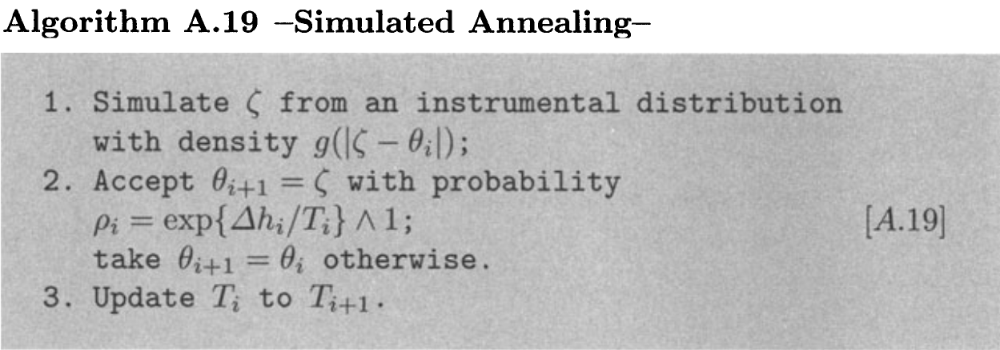
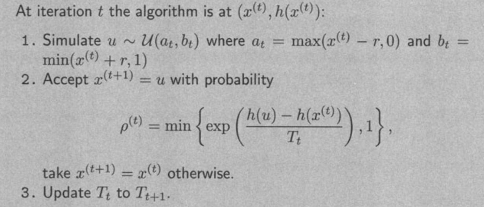

# Monte Carlo Optimization

## Recursive Integration


## Monte Carlo Maximization


## EM Algorithm


## Simulated Annealing

Fundamental idea: A change of scale, called **temperature**, allows for faster moves on the surface of the function of $h$ to maximize, whose negative is called **energy**.



It is important to note that if the larger $$T$$ is, accepting one decreasing is more likely.

Example: To maximize $$h(x)=[\cos(50x)+\sin(20x)]^2$$.



We can use the following Julia code to solve this problem:

```julia
r = 0.5
function T(t)
    return 1/log(t)
end
# target function
function h(x)
    return (cos(50x) + sin(20x))^2
end

N = 2500
x = ones(N)
y = ones(N)
for t = 1:(N-1)
    # step 1
    at = max(x[t]-r, 0)
    bt = min(x[t]+r, 1)
    u = rand() * (bt - at) + at 
    # step 2
    rho = min(exp( (h(u) - h(x[t])) / T(t) ), 1)
    if rand() < rho
        x[t+1] = u
        y[t+1] = h(u)
    else
        x[t+1] = x[t]
        y[t+1] = y[t]
    end
end
```

The trajectory of 2500 pairs $(x^{(t)}, y^{(t)})$ is 

