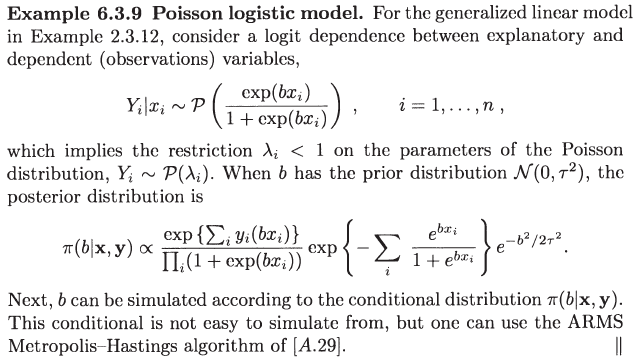

# ARMS Metropolis-Hastings

ARMS stands for Adaptive Rejection Metropolis Sampling, and it is the generalization of [ARS algorithm](https://mc.hohoweiya.xyz/genrv#ars-algorithm).


We can implement this algorithm with the following Julia program:

```julia
include("../GenRV/ars.jl")
using Main.corears
# ARMS
function arms(T, yfixed::Array)
    x = ones(T+1)
    for t = 1:T
        # generate Y
        while true
            global y
            y = gplus_sample(yfixed)
            u = rand()
            u <= exp(h(y)-hplus(y, yfixed)) && break
        end
        # accept or not
        v = rand()
        r = exp(h(y))*phi(x[t], yfixed)/(exp(h(x[t]))*phi(y, yfixed))
        println(r)
        if r >= 1
            x[t+1] = y
        else
            if v <= r
                x[t+1] = y
            else
                x[t+1] = x[t]
            end
        end
    end
    return(x)
end
```

Now let's apply ARMS to poisson logistic model:



```julia
# data
x = rand(10)
y = rand(10)
# parameters
tau = 1

# function of h
function h(b)
    return(b * sum(x .* y) - sum(log.(1 .+ exp.(b*x))) - sum(1 .- 1 ./ (1 .+ exp.(b*x))) - b^2/(2*tau^2))
end

# derivative of h
function dh(b)
    return(sum(x .* y) - sum(x .* (1 .- 1 ./ (1 .+ exp.(b*x)) )) + sum(x .* exp.(b*x) ./ (1 .+ exp.(b*x)).^2 ) - b/tau^2)
end

function phi(x, yfixed::Array)
    if exp(h(x)) <= exp(hplus(x, yfixed))
        return(exp(h(x)))
    else
        return(exp(hplus(x, yfixed)))
    end
end
## example
x = arms(10000, [-1.5, -0.7, 0.7, 1.5])
```