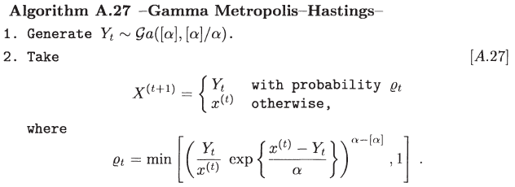
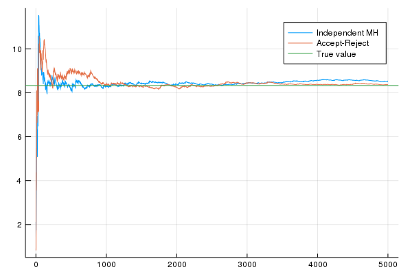
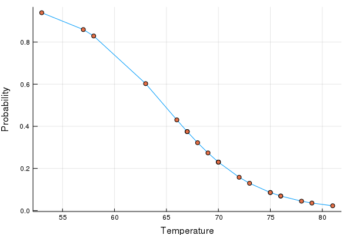
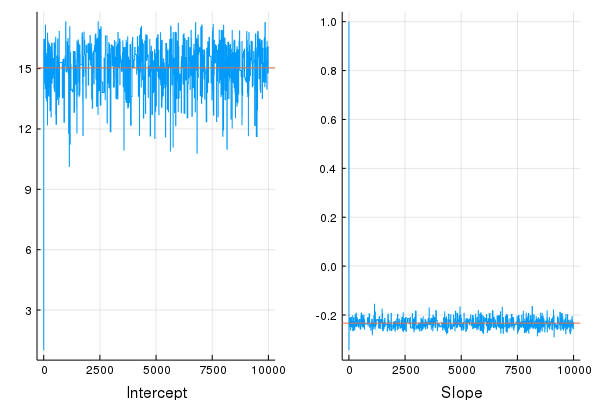

# Independent Metropolis-Hastings

## Gamma distribution

[Robert and Casella (2013)](https://www.springer.com/gp/book/9781475730715) presents the following algorithm:


If there exists a constant $$M$$ such that 

$$
f(x) \le Mg(x)\,,\qquad \forall x\in \mathrm{supp}\;f\,,
$$

the algorithm produces a uniformly ergodic chain ([Theorem](thm_imh.png)), and the expected acceptance probability associated with the algorithm is at least $$1/M$$ when the chain is stationary, and in that sense, the IMH is more efficient than the Accept-Reject algorithm.

Let's illustrate this algorithm with $${\mathcal G}a(\alpha, 1)$$. We have introduced how to sample from Gamma distribution via Accept-Reject algorithm in [Special Distributions](https://mc.hohoweiya.xyz/genrv/special), and it is straightforward to get the Gamma Metropolis-Hastings based on the ratio of $$f/g$$,



And we can implement this algorithm with the Julia code:

```julia
function mh_gamma(T = 100, alpha = 1.5)
    a = Int(floor(alpha))
    b = a/alpha
    x = ones(T+1) # initial value: 1
    for t = 1:T
        yt = rgamma_int(a, b)
        rt = (yt / x[t] * exp((x[t] - yt) / alpha))^(alpha-a)
        if rt >= 1
            x[t+1] = yt
        else
            u = rand()
            if u < rt
                x[t+1] = yt
            else
                x[t+1] = x[t]
            end
        end   
    end
    return(x)
end
```

To sample $${\mathcal G}a(2.43, 1)$$, and estimate $$\mathrm{E}_f(X^2)=2.43+2.43^2=8.33$$.

```julia
# comparison with accept-reject
res = mh_gamma(5000, 2.43)[2:end]
est = cumsum(res.^2) ./ collect(1:5000)

res2 = ones(5000)
for i = 1:5000
    res2[i] = rgamma(2.43, 1)
end
est2 = cumsum(res2.^2) ./ collect(1:5000)

using Plots
plot(est, label="Independent MH")
plot!(est2, label="Accept-Reject")
hline!([8.33], label="True value")
```



## Logistic Regression

We observe $$(x_i,y_i),i=1,\ldots,n$$ according to the model

$$
Y_i\sim\mathrm{Bernoulli}(p(x_i))\,,\qquad p(x) = \frac{\exp(\alpha+\beta x)}{1+\exp(\alpha+\beta x)}\,.
$$

The likelihood is 

$$
L(\alpha,\beta\mid \mathbf y) \propto \prod_{i=1}^n \Big(\frac{\exp(\alpha+\beta x_i)}{1+\exp(\alpha+\beta x_i)}\Big)^{y_i}\Big(\frac{1}{1+\exp(\alpha+\beta x_i)}\Big)^{1-y_i}
$$

and let $$\pi(e^\alpha)\sim \mathrm{Exp}(1/b)$$ and put a flat prior on $$\beta$$, i.e.,

$$
\pi_\alpha(\alpha\mid b)\pi_\beta(b) = \frac 1b e^{-e^\alpha/b}de^\alpha d\beta=\frac 1b e^\alpha e^{-e^\alpha/b}d\alpha d\beta\,.
$$

Note that 

$$
\begin{aligned}
\mathrm{E}[\alpha] &= \int_{-\infty}^\infty \frac{\alpha}{b}e^\alpha e^{-e^\alpha/b}d\alpha\\
&=\int_0^\infty \log w\frac 1b e^{-w/b} \\
&=\log b -\gamma\,,
\end{aligned}
$$

where 

$$
\gamma = -\int_0^\infty e^{-x}\log xdx
$$

is the [Euler's Constant](https://en.wikipedia.org/wiki/Euler–Mascheroni_constant). 

Choose the data-dependent value that makes $$\mathrm{E}\alpha=\hat\alpha$$, where $$\hat \alpha$$ is the MLE of $$\alpha$$, so $$\hat b=\exp(\hat \alpha+\gamma)$$.

We can use MLE to estimate the coefficient in the logistical model (see [my post](https://stats.hohoweiya.xyz/2017/07/30/Estimate-Parameters-in-Logistic-Regression/) for the derivation), and the following Julia code can help us fit the model quickly.

```julia
using DataFrames, GLM, Plots

temp = [53, 57, 58, 63, 66, 67, 67, 67, 68, 69, 70, 70, 70, 70, 72, 73, 75, 75, 76, 76, 78, 79, 81]
failure = [1, 1, 1, 1, 0, 0, 0, 0, 0, 0, 0, 0, 1, 1, 0, 0, 0, 1, 0, 0, 0, 0, 0]
data = DataFrame(temp = temp, failure = failure)
logit_fit = glm(@formula(failure ~ temp), data, Binomial(), LogitLink())
plot(temp, predict(logit_fit), legend = false, xlabel = "Temperature", ylab = "Probability")
scatter!(temp, predict(logit_fit))
```



The estimates of the parameters are $$\hat\alpha=15.0479, \hat\beta=-0.232163$$ and $$\hat\sigma_\beta = 0.108137$$. 

Wrote the following Julia code to implement the independent MH algorithm,

```julia
## metropolis-hastings
using Distributions
γ = 0.57721
function ll(α::Float64, β::Float64)
    a = exp.(α .+ β*temp)
    return prod( (a ./ (1 .+ a) ).^failure .* (1 ./ (1 .+ a)).^(1 .- failure) )
end
function mh_logit(T::Int, α_hat::Float64, β_hat::Float64, σ_hat::Float64)
    φ = Normal(β_hat, σ_hat)
    π = Exponential(exp(α_hat+γ))
    Α = ones(T)
    Β = ones(T)
    for t = 1:T-1
        α = log(rand(π))
        β = rand(φ)
        r = ( ll(α, β) / ll(Α[t], Β[t]) ) * ( pdf(φ, β) / pdf(φ, Β[t]) )
        if rand() < r
            Α[t+1] = α
            Β[t+1] = β
        else
            Α[t+1] = Α[t]
            Β[t+1] = Β[t]
        end
    end
    return Α, Β
end

Α, Β = mh_logit(10000, 15.04, -0.233, 0.108)

p1 = plot(Α, legend = false, xlab = "Intercept")
hline!([15.04])

p2 = plot(Β, legend = false, xlab = "Slope")
hline!([-0.233])

plot(p1, p2, layout = (1,2))
```




## Saddlepoint tail area approximation

If $$K(\tau) = \log({\mathbb E}\exp(\tau X))$$ is the [cumulant generating function](https://en.wikipedia.org/wiki/Cumulant), solving the saddlepoint equation $$K'(\tau)=x$$ yields the saddlepoint. For noncentral chi squared random variable $$X$$, the moment generating function is 

$$
\phi_X(t) = \frac{\exp(2\lambda t/(1-2t))}{(1-2t)^{p/2}}\,,
$$

where $$p$$ is the number of degrees of freedom and $$\lambda$$ is the noncentrality parameter, and its saddlepoint is 

$$
\hat\tau(x) = \frac{-p+2x-\sqrt{p^2+8\lambda x}}{4x}\,.
$$

The saddlepoint can be used to approximate the tail area of a distribution. We have the approximation

$$
\begin{aligned}
P(\bar X>a) &= \int_a^\infty \Big(\frac{n}{2\pi K_X''(\hat\tau(x))}\Big)^{1/2}\exp\{n[K_X(\hat\tau(x))-\hat\tau(x)x]\}dx\\
&= \int_{\hat\tau(a)}^{1/2} \Big(\frac{n}{2\pi}\Big)^{1/2}[K_X''(t)]^{1/2}\exp\{n[K_X(t)-tK_X'(t)]\}dt\,.
\end{aligned}
$$