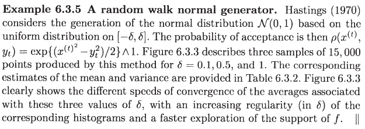
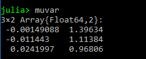

# Random walk Metropolis-Hastings


We can write the following Julia code which use uniform distribution $${\mathcal U}[-\delta,\delta]$$ as $$g$$.

```julia
# random walk Metropolis-Hastings
function rmh(T, delta, f::Function, initval = 5)
    x = ones(T+1)
    x[1] = initval
    for t = 1:T
        # generate Yt
        epsi = rand() * 2 * delta - delta
        Yt = epsi + x[t]
        # accept or not
        u = rand()
        r = f(Yt)/f(x[t])
        if r >= 1
            x[t+1] = Yt
        else
            if u <= r
                x[t+1] = Yt
            else
                x[t+1] = x[t]
            end
        end
    end
    return(x)
end
```

Then apply this algorithm to the normal distribution:



```julia
# density function of N(0, 1) without normalization
function dnorm(x)
    return(exp(-0.5 * x^2))
end

# example
deltalist = [0.1, 0.5, 1]
N = 15000
# results of mean and variance
muvar = zeros(3, 2)
using Statistics
ps = []
for i = 1:3
    x = rmh(N, deltalist[i], dnorm)
    push!(ps, plot(x, legend=:none))
    muvar[i, 1] = mean(x)
    muvar[i, 2] = var(x)
end
# plot
plot(ps[1], ps[2], ps[3], layout=(3,1))
savefig("res_rmh.png")
```

We will get the table of mean and variance as showed in Table 6.3.2 of [Robert and Casella (2013)](https://www.springer.com/gp/book/9781475730715) 



and the curve of each case:


