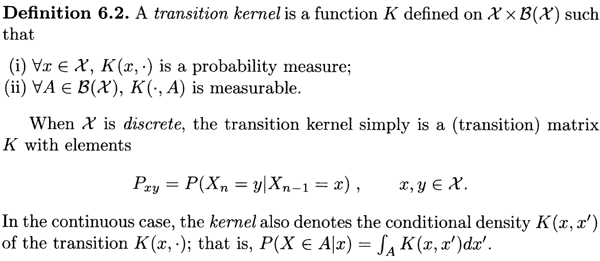
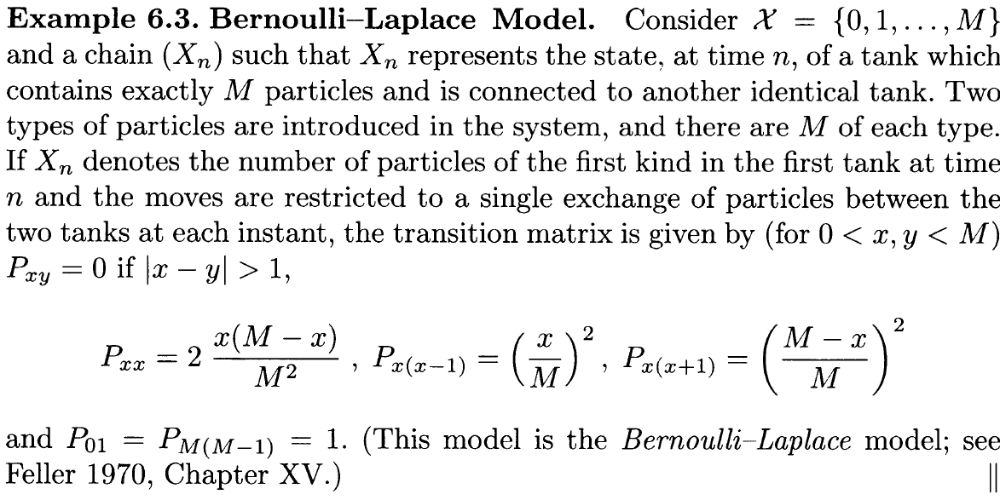
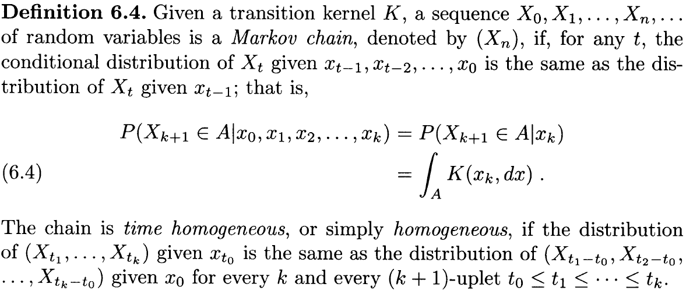

## Essential properties of Markov Chain

In the setup of MCMC algorithms, we construct Markov chains from a transition kernel $$K$$, a conditional probability density such that $$X_{n+1}\sim K(X_n,X_{n+1})$$.

The chain encountered in MCMC settings enjoy a very strong stability property, namely a **stationary probability distribution**; that is, a distribution $$\pi$$ such that if $$X_n\sim\pi$$, then $$X_{n+1}\sim \pi$$, if the kernel $$K$$ allows for free moves all over the state space. This freedom is called **irreducibility** in the theory of Markov chains and is formalized as the existence of $$n\in\mathbb{N}$$ such that $$P(X_n\in A\mid X_0)>0$$ for every $$A$$ such that $$\pi(A)>0$$. This property also ensures that most of the chains involved in MCMC algorithms are **recurrent** (that is, that the average number of visits to an arbitrary set $A$ is infinite), or even **Harris recurrent** (that is, such that the probability of an infinite number of returns to $A$ is 1).

**Harris recurrence** ensures that the chain has the same limiting behavior for every starting value instead of almost every starting value.

The stationary distribution is also a limiting distribution in the sense that the limiting distribution of $$X_{n+1}$$ is $$\pi$$ under the total variation norm, notwithstanding the initial value of $$X_0$$.

Strong forms of convergence are also encountered in MCMC settings, like geometric and uniform convergences. 

If the marginals are proper, for convergence we only need our chain to be aperiodic. A sufficient condition is  that $$K(x_n,\cdot)>0$$ (or, equivalently, $$f(\cdot\mid x_n)>0$$) in a neighborhood of $$x_n$$.

If the marginal are not proper, or if they do not exist, then the chain is not positive recurrent. It is either null recurrent, and both cases are bad.

## Basic Notions

