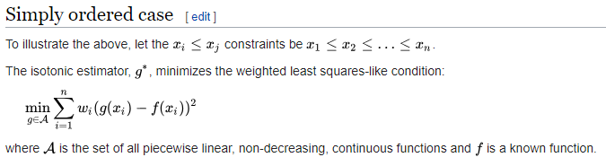
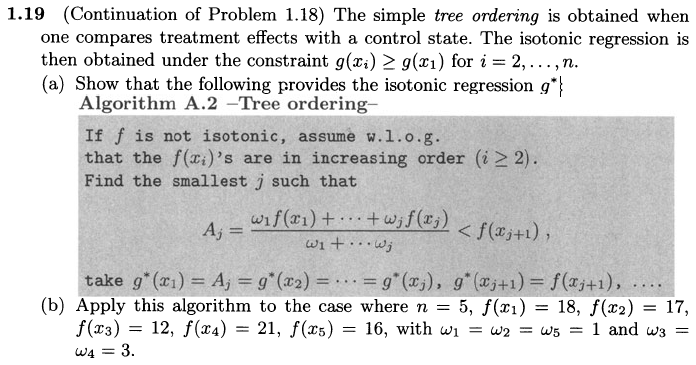

# Various topics

## Pool-adjacent-violators algorithm

[Robert and Casella (2005)](http://cds.cern.ch/record/1187871) provides the following exercise related to pool-adjacent-violators algorithm.


We need to learn [isotonic regression](https://en.wikipedia.org/wiki/Isotonic_regression) first, and it turns out that this is exactly the simply ordered case mentioned in the wiki.



Use R program to solve this problem, and the code is as follows.

```r
pooladv <- function(f, w)
{
  n = length(f)
  lag = diff(f)
  if (sum(lag < 0) == 0) # f is isotonic
    return(f)
  while (TRUE) {
    idx = which(lag < 0)[1] + 1
    newf = (w[idx]*f[idx] + w[idx-1]*f[idx-1])/(w[idx]+w[idx-1])
    f[idx] = newf
    f[idx-1] = newf
    lag = diff(f)
    if (sum(lag < 0) == 0)
      return(f)
  }
}

## example
pooladv(c(23, 27, 25, 28), rep(1, 4))
# ans: 23, 26, 26, 28
```

We can also use another scientific programming language, Julia.

```julia
function pooladv(f::Array, w::Array)
   n = size(f, 1)
   lag = diff(f)
   if all(i -> i >= 0, lag)
        return(f)
   end
   while true
        for i = 1:(n-1)
            global idx
            idx = i+1
            lag[i] < 0 && break
        end
        newf = (w[idx]*f[idx] + w[idx-1]*f[idx-1])/(w[idx]+w[idx-1])
        f[idx] = newf
        f[idx-1] = newf
        lag = diff(f)
        if all(i -> i>=0, lag)
            return(f)
        end
   end
end

## example
g = pooladv([23, 27, 25, 28], ones(4))
for i in eachindex(g)
    println(g[i])
end
```

## Tree ordering

In [Robert and Casella (2005)](http://cds.cern.ch/record/1187871), there is another exercise about isotonic regression, which is the continuation of the previous section.



The following Julia program can be used to solve this exercise.

```julia
function treeordering(f::Array, w::Array)
    n = size(f, 1)
    lag = diff(f)
    # if f is isotonic
    if all(i -> i >= 0, lag)
        return(f)
    end
    for j = 1:n
        Aj = sum(f[1:j].*w[1:j])/sum(w[1:j])
        if Aj < f[j+1]
            return([Aj*ones(j); f[(j+1):end]])
        end
    end
end

## example
treeordering([18,17,12,21,16], [1,1,3,3,1])
```
