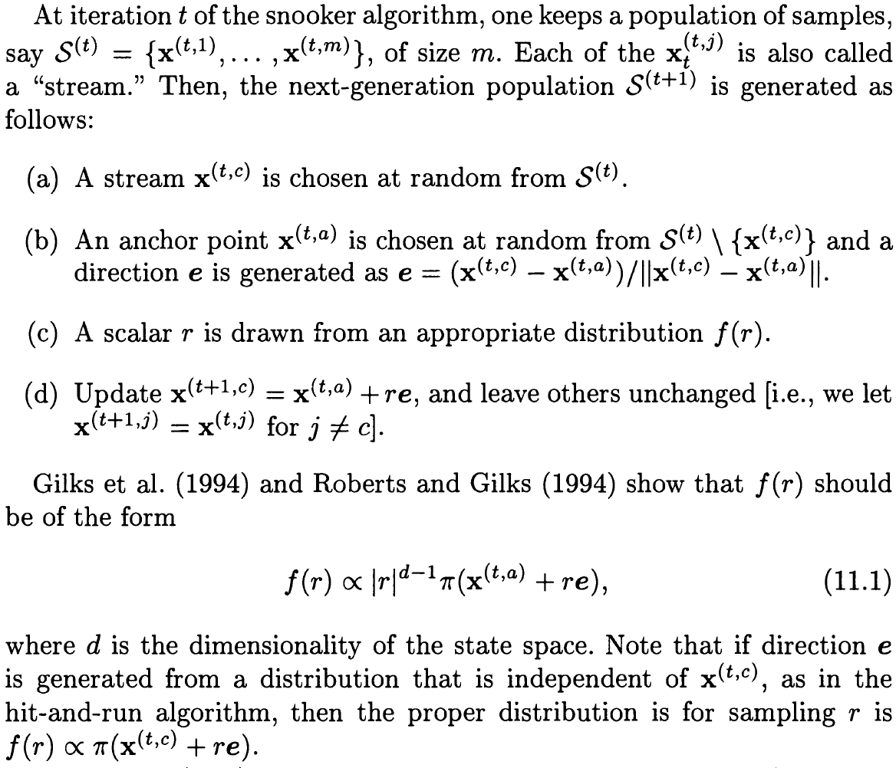
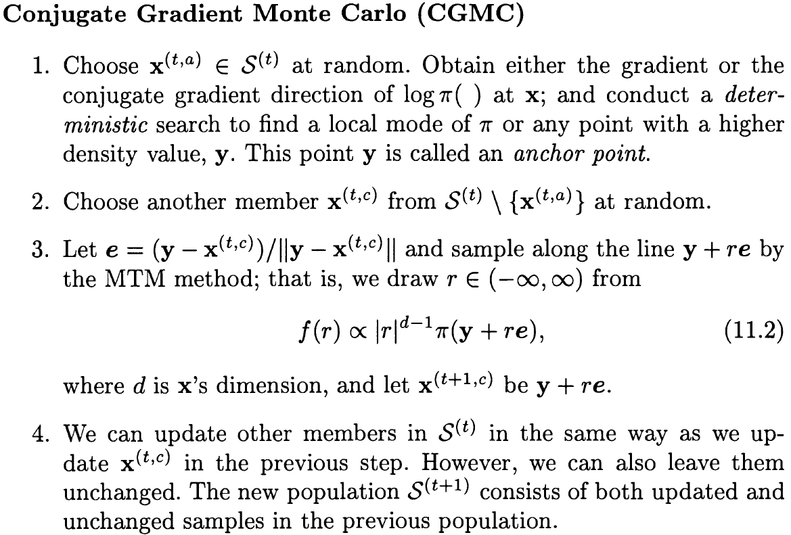
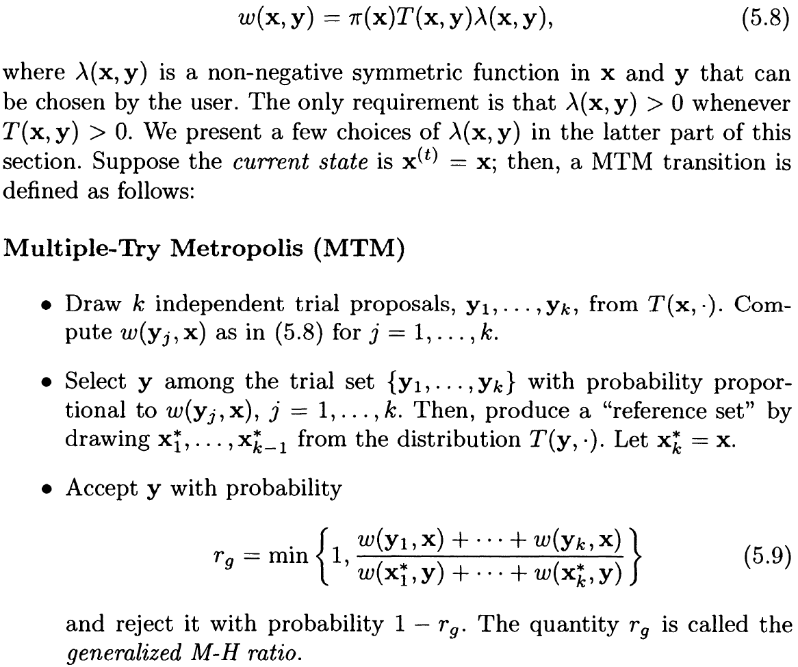
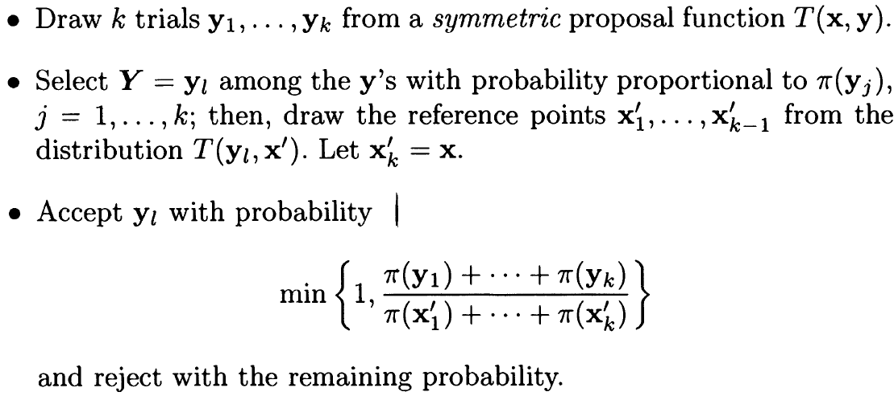
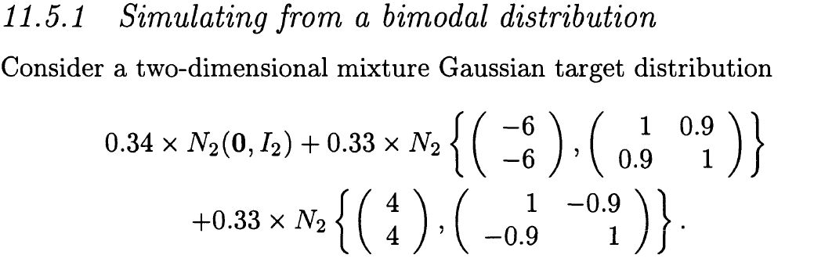
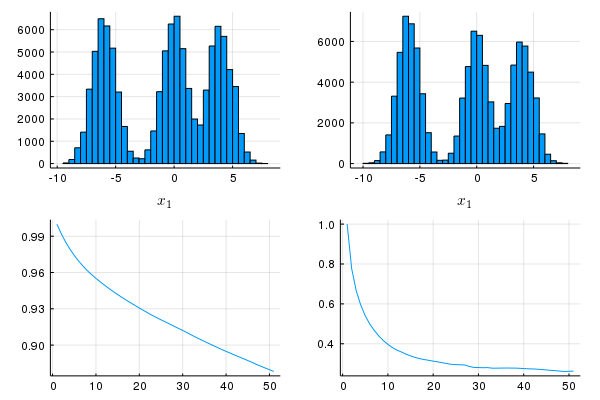

# Population-Based Monte Carlo Methods

This note is mainly based on Chapter 12 of Liu (2008).

## Adaptive Direction Sampling (ADS): Snooker Algorithm



## Conjugate Gradient Monte Carlo (CGMC)



where MTM refers to 



and its simplified version **orientational bias Monte Carlo (OBMC)** when $$w(\mathbf x, \mathbf y)=\pi(\mathbf x)$$:



### Bimodal Example



whose contour plot is 


For the general MH procedure:

```julia
function propose(x; a = 4)
    θ = rand() * 2π
    r = rand() * 4
    return [x[1] + r*cos(θ), x[2] + r*sin(θ)]
end

function iMH(M = 200000)
    # start points
    x = [rand() - 0.5, rand() - 0.5]
    X = ones(M, 2)
    num = 0
    for m = 1:M
        xs = propose(x)
        ρ = targetpdf(xs) / targetpdf(x)
        if rand() < ρ
            x = xs
            num += 1
        end
        X[m,:] = x
    end
    return X, num/M
end
```

For CGMC, there is a long way to go. Firstly, find out the derivative of target pdf and find the anchor point:

```julia
# derivative of targetpdf
function dm(x; step = 0.05, nmaxstep = 100)
    term1 = w[1] / 2π * exp(-0.5*sum(x.^2))
    term2 = w[2] / (2π * 0.19) * exp( -0.5 * transpose(x.+6) * invΣ2 * (x.+6) )
    term3 = w[3] / (2π * 0.19) * exp( -0.5 * transpose(x.-4) * invΣ3 * (x.-4) )
    term = term1 .+ term2 * invΣ2 + term3 * invΣ3
    # negative of gradient direction (remove the minus symbol already)
    dx1 = term[1,1]*x[1] + term[1,2]*x[2]
    dx2 = term[2,1]*x[1] + term[2,2]*x[2]
    dx = [dx1, dx2]
    # find local maximum
    bst = targetpdf(x)
    i = 0
    while i < nmaxstep
        i += 1
        cur = targetpdf(x .- step * dx)
        if cur > bst
            bst = cur 
            x = x .- step * dx
        else
            break
        end
    end
    return x
end
```

Then implement MTM algorithm for sampling radius $$r$$:

```julia
function MTM(anchor, direction;M = 100, k = 5, σ = 10)
    # use the simplified version: OBMC algorithm
    # initial x
    x = 2*rand()-1
    num = 0
    for m = 1:M 
        y = ones(k)
        wy = ones(k)
        for i = 1:k
            y[i] = rand(Normal(x, σ))
            wy[i] = f(y[i], anchor, direction)
        end
        #wy = wy ./ sum(wy)
        yl = sample(y, pweights(wy))
        # draw reference points
        xprime = ones(k)
        xprime[k] = x
        wxprime = ones(k)
        wxprime[k] = f(x, anchor, direction)
        for i = 1:k-1
            xprime[i] = rand(Normal(yl, σ))
            wxprime[i] = f(xprime[i], anchor, direction)
        end
        # accept or not 
        ρ = sum(wy) / sum(wxprime)
        if rand() < ρ
            x = yl
            num += 1
        end
    end
    return x, num/M
end
```

Finally, we can combine these sub-procedures:

```julia
function cgmc(M = 200000)
    # start points (each col is a stream)
    x = rand(2, 2) .- 0.5
    X = ones(M, 4)
    for m = 1:M
        # randomly choose xa
        xaIdx = sample([1,2])
        xa = x[:,xaIdx]
        # find gradient of pdf at xa (or conjugate gradient of log pdf at xa)
        y = dm(xa)
        xcIdx = 3 - xaIdx
        xc = x[:,xcIdx]
        e = y - xc
        e = e / norm(e)
        # sample r
        r, = MTM(y, e)
        # update xc
        x[:,xcIdx] = y .+ r*e
        X[m, :] .= vec(x)
    end
    return X
end
```

Refer to [bimodal-example.jl](bimodal-example.jl) for the complete source code. Run the program, I can reproduce Fig 11.1 successfully,



## Evolutionary Monte Carlo (EMC)


