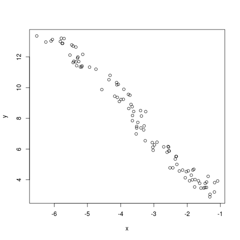
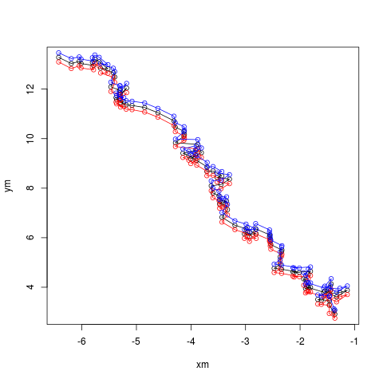

# State Space Model

Let us take a simple example to illustrate how SMCTC library implement this kind of problem.

The state vector  contains the position and velocity of an object moving in a plane:

The observation of the position is possible at each time instance. The state and observation equations are linear with additive noise:

where

And assuming that the elements of  are independent normal with variances 0.02 and 0.001 for position and velocity components, respectively. The observation noise, , comprise independent, identically distributed t-distributed random variables with  degrees of freedom.

The observations are as follows:

Apply the SMC algorithm to the SSM, and calculate the mean of position at each iteration, we can obtain the following results:

